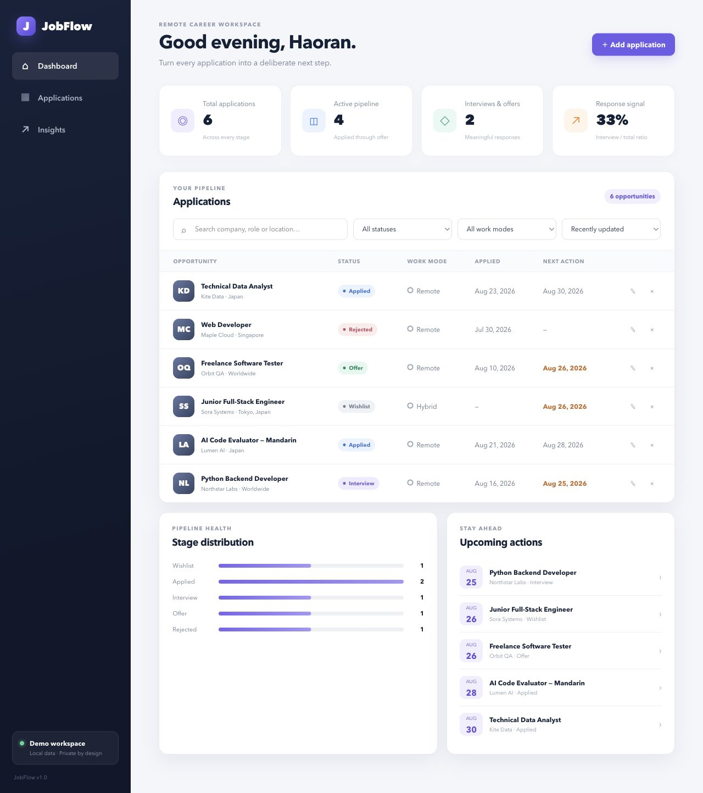

# JobFlow

[](https://github.com/T98765SREDT/jobflow/actions/workflows/ci.yml)
[](app.py)
[](app.py)
[](LICENSE)

JobFlow is a local-first job application tracker built with Python, SQLite, and vanilla JavaScript. It keeps applications, lifecycle stages and outcomes, follow-up dates, notes, role requirements, application materials, submission snapshots, saved views, and pipeline metrics in one workspace. The complete local app starts with one Python command and requires no package installation.

[Dashboard screenshot](docs/jobflow-dashboard.png) · [Browser demo source](static/index.html) · [Run locally](#run-the-complete-local-app) · [HTTP API](#http-api) · [Browser evidence](docs/e2e.md) · [Benchmark](docs/benchmark.md) · [Architecture](ARCHITECTURE.md) · [Security](SECURITY.md)

> **The Pages build and local app are different runtimes.** When GitHub Pages is enabled, it runs the browser interface with resettable synthetic data stored in `localStorage`; it cannot run the Python API or SQLite. Clone the repository to use the complete browser → API → validation → database path.



> **Screenshot note:** this checked-in PNG is a static visual snapshot of the
> seeded demo, not the runtime version contract. Use the local app or the
> browser demo to verify current behavior; the footer and `/api/health` response
> are the source of truth for the running version.

## What you can do

- Create, edit, inspect, and delete applications with role, company, stage/status, outcome, work mode, compensation, dates, source, URL, and notes.
- Search the workspace, combine status and work-mode filters, sort results, and move through paginated records.
- Switch the same filtered pipeline between a responsive table and an accessible stage board; use **Move to…** on any open card instead of relying on drag-and-drop.
- Switch between All, Active, Needs follow-up, Interviews, and Offers views; the current filters remain in the page URL.
- See overdue and due-soon actions, a prioritized needs-attention queue, the next five follow-ups, stage totals, and interview/offer response rate.
- Review a timestamped historical funnel for submitted, responded, interviewed, offered, accepted, and no-response applications, with stage-duration medians and source conversion.
- Manage independent preparation, interview, decision, follow-up, and custom tasks; complete or postpone them without losing application history.
- Use the Today API/action feed to separate overdue work, due today, upcoming work, waiting applications, and active records missing a next step.
- Download a versioned JSON backup or spreadsheet-safe CSV export.
- Import a CSV from a spreadsheet with a preview, automatic header matching, manual column mapping, row-level validation, and one atomic write. Before anything is changed, duplicate candidates are shown with **Skip**, **Keep separate**, or an explicit field-by-field **Merge** choice.
- Export dated next actions as an iCalendar (`.ics`) file for a personal calendar.
- Restore a JSON backup in append or replace mode. Every record and its activity timeline are validated before the database changes, and replace mode runs in one transaction.
- Review an activity timeline for each application; status, follow-up-date, and note changes are recorded automatically, while interviews and custom updates can be added manually.
- Open a single application workspace with Overview, Tasks, Materials, Requirements, and Activity tabs backed by one consistent snapshot request.
- Capture role requirements with a transparent met/partial/gap/unknown assessment, supporting evidence, and weighted coverage summary; unknown items stay outside the coverage denominator.
- Track metadata for job descriptions, resumes, cover letters, portfolios, and assessments without uploading files; label versions and keep links to the canonical source.
- Create immutable submission snapshots that preserve exactly which material versions were used for an application; referenced materials cannot be deleted accidentally.
- Use a keyboard-friendly confirmation flow for destructive actions, focus the search box with `Cmd/Ctrl+K`, and keep screen-reader status updates attached to result changes.

## Browser demo

The static demo in [`static/`](static/) is ready to publish with GitHub Pages. It supports CRUD operations, search, saved views, filters, sorting, pagination, a Today action center, current pipeline analytics, historical funnel/source insights, application requirements/evidence, material version metadata, immutable submission snapshots, JSON backup/restore, CSV import/export, and calendar export without a server. A ready-to-try mapping fixture is included at [`examples/applications.csv`](examples/applications.csv). Until the Pages deployment is enabled, use the dashboard screenshot above or run the complete app locally.

The demo contains fictional applications only. Changes remain in the current browser until you use **Reset demo** or clear the site's local storage.

When the local workspace is empty, JobFlow shows a short **Start here** panel with separate actions for adding the first application, importing a CSV/backup, and learning the workflow. The runtime badge always identifies whether the page is using the local Python API + SQLite workspace or the synthetic browser demo.

## Evidence and verification

The repository includes a reproducible browser workflow check, a disposable
read-performance benchmark, and a CI matrix. Browser checks run in Chromium,
Firefox, and WebKit; they use a temporary database and never use personal
application data. The exact scenarios and local commands are documented in
[`docs/e2e.md`](docs/e2e.md). The benchmark and its interpretation are in
[`docs/benchmark.md`](docs/benchmark.md).

## Run the complete local app

Requirements: Python 3.9 or newer.

```bash
git clone https://github.com/T98765SREDT/jobflow.git
cd jobflow
python3 app.py --seed-demo
```

Open [http://127.0.0.1:8000](http://127.0.0.1:8000). The first run creates `data/jobflow.db`; `--seed-demo` adds six fictional applications only when the database is new. Omit that flag to start with an empty workspace.

Host, port, and database path can be changed from the command line:

```bash
python3 app.py --host 127.0.0.1 --port 8080 --db /tmp/jobflow-demo.db
```

The same values can be set with `JOBFLOW_HOST`, `JOBFLOW_PORT`, and `JOBFLOW_DB`.

## HTTP API

| Method | Endpoint | Purpose |
|---|---|---|
| `GET` | `/api/health` | Service health and version |
| `GET` | `/api/meta/options` | Valid stage/outcome, deprecated status, work-mode, currency, and salary-period options |
| `GET` | `/api/applications` | Search, filter, sort, and paginate applications |
| `POST` | `/api/applications` | Validate and create an application |
| `GET` | `/api/applications/:id` | Retrieve one application |
| `GET` | `/api/applications/:id/workspace` | Retrieve application, tasks, requirements, materials, submission history, activity, and summary in one snapshot |
| `PATCH` | `/api/applications/:id` | Validate and apply a partial update |
| `POST` | `/api/applications/:id/transitions` | Apply an audited, idempotent lifecycle transition |
| `DELETE` | `/api/applications/:id` | Delete an application |
| `GET` | `/api/applications/:id/events` | Retrieve the application activity timeline |
| `POST` | `/api/applications/:id/events` | Add an interview, follow-up, note, or custom activity |
| `DELETE` | `/api/applications/:id/events/:event_id` | Remove one timeline entry |
| `GET` | `/api/analytics` | Pipeline totals, upcoming actions, and a prioritized attention queue |
| `GET` | `/api/insights?window=30\|90\|all` | Historical submission funnel, response timing, stage-duration medians, and source conversion |
| `GET` | `/api/today?as_of=YYYY-MM-DD` | Deterministic daily task/action feed |
| `GET` | `/api/applications/:id/tasks` | List an application's tasks |
| `POST` | `/api/applications/:id/tasks` | Create a task |
| `PATCH` | `/api/tasks/:id` | Edit a task with optional `expected_version` |
| `POST` | `/api/tasks/:id/complete` | Complete a task (idempotent) |
| `POST` | `/api/tasks/:id/snooze` | Move a task to a new date; requires `expected_version` |
| `GET` | `/api/applications/:id/requirements` | List role requirements in stable display order |
| `POST` | `/api/applications/:id/requirements` | Add a requirement with assessment, evidence, and weight |
| `PUT` | `/api/applications/:id/requirements` | Replace the requirement display order atomically |
| `PATCH` | `/api/requirements/:id` | Edit one requirement |
| `DELETE` | `/api/requirements/:id` | Remove one requirement |
| `GET` | `/api/applications/:id/artifacts` | List application material metadata |
| `POST` | `/api/applications/:id/artifacts` | Add a material with an optional http(s) link and version label |
| `PATCH` | `/api/artifacts/:id` | Edit material metadata |
| `DELETE` | `/api/artifacts/:id` | Remove an unreferenced material |
| `GET` | `/api/applications/:id/submissions` | List immutable submission snapshots |
| `POST` | `/api/applications/:id/submissions` | Capture selected material versions as a submission snapshot |
| `GET` | `/api/submissions/:id` | Retrieve one read-only submission snapshot |
| `GET` | `/api/export` | Versioned JSON backup |
| `POST` | `/api/import/preview` | Validate import rows and return duplicate candidates without writing |
| `POST` | `/api/import?mode=append\|replace` | Validate and restore a JSON backup atomically |

List parameters are `search`, `status`, `stage`, `work_mode`, `sort`, `direction`, `view`, `page`, and `limit`.

Errors use a stable envelope. The nested member is the contract; top-level
route-specific fields such as `current` and `conflicts` are included for
recovery actions:

```json
{
  "error": {
    "code": "VERSION_CONFLICT",
    "message": "This application changed in another session.",
    "fields": {},
    "retryable": false,
    "request_id": "9f3c..."
  }
}
```

The server also returns the same id in `X-Request-ID`. The browser retries only
idempotent reads, at most twice, for transient network/service failures; it
never retries a write implicitly.

Transition requests send `to_stage`, an `outcome` when closing, and should
include the record's `expected_version` plus a stable `request_id`. A stale
version returns `409` with the current application; repeating the same request
ID returns the original event with `replayed: true`.

```bash
curl "http://127.0.0.1:8000/api/applications?view=active&work_mode=Remote&page=1&limit=20"
curl "http://127.0.0.1:8000/api/export" > jobflow-backup.json
```

The response rate shown in the current dashboard is the number of applications currently at Interview or Offer divided by all submitted applications; Wishlist records are excluded. Historical insights use a different, event-based definition: a submission is the first recorded transition to `Applied` in the selected window; responded means the first later transition to `Interview`, `Offer`, or `Closed`; Interview, Offer, and Accepted are “ever reached” outcomes, so a later rejection does not erase earlier progress. Source rates use each source's submitted cohort as denominator. Missing timestamps and legacy rows are labeled as limited history rather than reconstructed; `history_quality.limited_total` keeps those records visible even when they fall outside the selected submitted cohort. Stage-duration medians include completed, timestamped intervals only; open intervals are not estimated. Schema v8 separates active `stage` from terminal `outcome`, stores independent tasks, adds application requirements with evidence, and stores material metadata plus immutable submission snapshots. The older `status` response field and `next_action_date` remain compatibility projections while clients migrate. Requirement coverage is calculated only from known assessments: `met` contributes its full weight, `partial` contributes half, and `unknown` is shown separately rather than treated as a gap. Lifecycle and task writes use `expected_version` for stale-write detection, while transitions also accept a stable `request_id` for safe retries. Submission packages copy material labels, links, and version labels at creation time, so later edits do not rewrite history; a referenced material is protected from deletion. Older JSON backups remain importable; backups created by v8 include `tasks`, `requirements`, `artifacts`, and `submissions` arrays for each application.

## Tests and verification

The repository has 96 Python tests plus 6 dependency-free Node checks across validation, duplicate fingerprints, SQLite migrations and transactions, lifecycle compatibility, audited transitions, CRUD behavior, task concurrency and Today classification, requirements evidence and coverage, material validation and immutable snapshots, saved views, pagination, current analytics, historical funnel/source insights, activity events, workspace snapshots, board contracts, HTTP status handling, request-id/error envelopes, static-file delivery, first-run guidance, draft/cache recovery, CSV mapping, duplicate preview/merge decisions, and backup/restore. The optional Playwright suite covers the cross-layer browser workflows described in [`docs/e2e.md`](docs/e2e.md).

```bash
python3 -m unittest discover -s tests -v
python3 -m compileall -q app.py jobflow tests
node --check static/app.js
node --check static/demo-data.js
node --check static/csv.js
node --test tests/*.test.mjs
python3 scripts/benchmark.py --applications 100 --events-per-application 2 --tasks-per-application 1 --iterations 2
```

Tests create temporary databases and do not modify `data/jobflow.db`. GitHub Actions runs the suite on Python 3.9, 3.11, and 3.12, runs the benchmark smoke check, checks all browser JavaScript files, and runs the Playwright workflow in Chromium, Firefox, and WebKit. Install the test-only browser dependency and start JobFlow on port 8765 before running the optional browser suite locally; see [`docs/e2e.md`](docs/e2e.md).

## Architecture

```text
Browser UI (HTML/CSS/JavaScript)
        │ fetch + JSON
        ▼
ThreadingHTTPServer + route handler
        │ normalized records
        ▼
Validation layer ── SQLite query layer
                         │ transaction
                         ▼
                     local database
```

- `app.py` reads runtime options and starts the server.
- `jobflow/server.py` owns routes, request parsing, JSON responses, static files, and HTTP status codes.
- `jobflow/validation.py` normalizes application data and returns field-level errors.
- `jobflow/database.py` owns the schema, migrations, parameterized SQL, transactions, seeding, filters, and analytics.
- `static/` contains the responsive interface, CSV mapping helpers, and the browser-only demo adapter.
- `tests/` checks the validation, persistence, and HTTP boundaries separately.

See [ARCHITECTURE.md](ARCHITECTURE.md) for the request lifecycle, backup boundary, and design decisions.

## Reliability and security boundaries

- SQL values use parameters; selectable sort columns come from an allowlist.
- Static paths are resolved against the public directory and checked before files are served.
- JSON request bodies are limited to 1 MB, and invalid input returns structured field errors.
- SQLite uses schema versioning, WAL mode, a busy timeout, and commit-or-rollback transactions.
- Replace imports validate every application before existing records are deleted.
- The server binds to `127.0.0.1` by default.

JobFlow is a single-user local application. It has no authentication, authorization, encrypted storage, or public deployment configuration. Do not expose it directly to the internet or place confidential application data in the public browser demo. See [SECURITY.md](SECURITY.md) for the supported security scope.

## Repository map

```text
app.py                  local command-line entry point
jobflow/server.py       HTTP routing and JSON/static responses
jobflow/validation.py   normalization and field validation
jobflow/database.py     SQLite schema, queries, transactions, analytics
static/                 responsive UI, CSV mapping helpers, and GitHub Pages demo adapter
tests/                  validation, database, and API tests
examples/               import fixtures for the browser workflow
docs/                   screenshot, browser evidence, and benchmark guidance
```

Contribution checks are in [CONTRIBUTING.md](CONTRIBUTING.md), browser workflow evidence is in [docs/e2e.md](docs/e2e.md), benchmark guidance is in [docs/benchmark.md](docs/benchmark.md), screenshot guidance is in [docs/README.md](docs/README.md), and user-visible changes are recorded in [CHANGELOG.md](CHANGELOG.md).

## License

[MIT](LICENSE)
